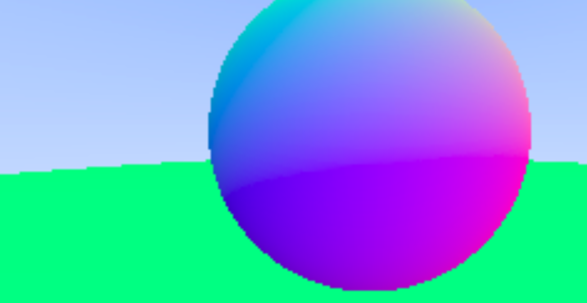
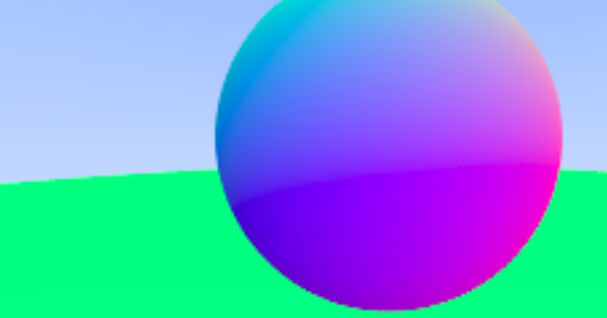
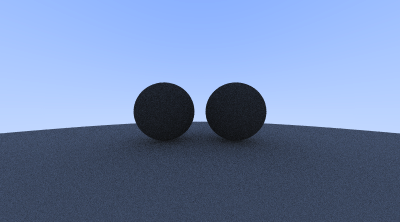
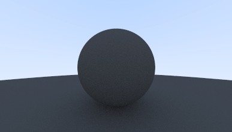
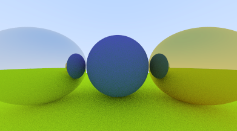

## Notes

- so right now we create pixel values for a image and write it to a file
- vec3
  - point3
  - color

**ray**  
 P = A + tb
where,  
 P: 3D position along a line in 3D  
 A: ray origin  
 b: ray direction  
 t: ray parameter. moves the point along the ray

## Antialiasing

Before:
  

After:
  

## Diffuse Materials

## Fixed shadow acne

## Lambertian distribution

## gamma correction for accurate color intensity

## Metal

