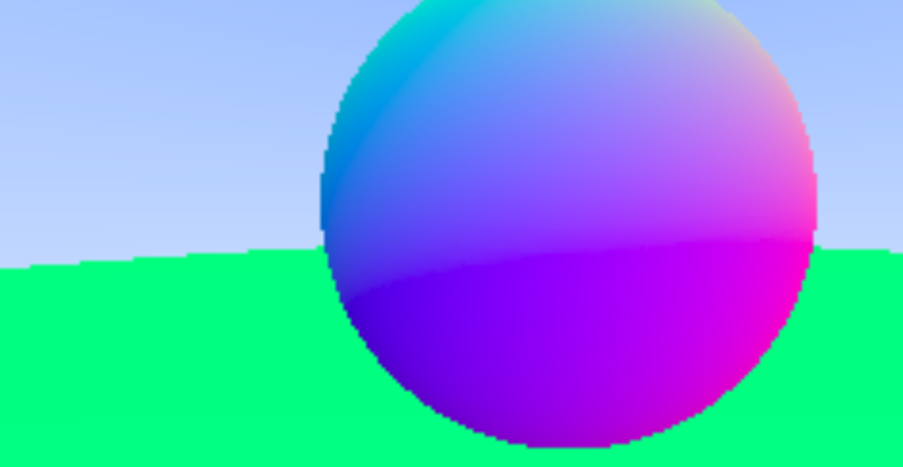
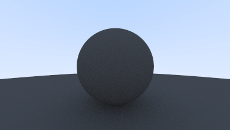

# Raytracer

My attempt at building a raytracer from scratch following raytracing-in-a-weekend guide. With a raytracer you can model objects in 3D space and generate images for what they'd look like by applying your own colours, angles and lightning. I learned a lot of maths and computer graphics.

To execute simply compile with `g++ main.cc` and then run `./a.out > image.ppm`.

## Antialiasing

Before:
  

After:
  

## Diffuse Materials

## gamma correction for accurate color intensity

## Metal

